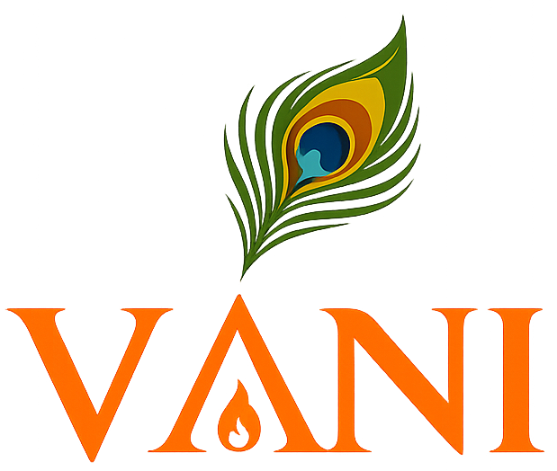

# Introduction

Welcome to the **vāṇी** (वाणी) tutorials.

vāṇी is a programming language designed to read like speech,
not symbols. The name (Sanskrit for *"speech"*) expands to
*Verbose Alternative Natural Interface*. You write `fn add(a: i64, b: i64) -> i64`
and vāṇी turns it into a fast native binary -- no startup
overhead, no garbage collector slowing things down. It supports
62 human languages as keyword sets (English, Hindi, Sanskrit,
Mandarin, Arabic, and more), so you can write code in the
language you think in.

**No CS background required.** Every computer-science concept
in these tutorials is introduced with an everyday analogy BEFORE
the code. Look for chapters labelled *"intuition primer"* -- they
contain no code and exist specifically for readers coming from
non-technical backgrounds. You can read them on a train with no
laptop. The code chapters then assume you've built the mental
model first.

> **⚠️ Note on natural-language dialects.** vāṇी ships keyword
> tables for 62 dialects across 26 scripts, but only **English**
> and the **Devanagari Indo-Aryan family** (Sanskrit / Hindi /
> Marathi as primary; Nepali / Maithili / Konkani as close
> relatives) have been native-speaker-verified by the authors.
> Every other dialect's vocabulary -- Bengali, Tamil, Mandarin,
> Japanese, Korean, Arabic, Russian, Spanish, and the rest --
> was drafted from reference grammars + loan-word patterns and
> may sound wrong, formal, or archaic to fluent users. A
> grammar-consultant pass for native-speaker review is queued
> in [TODO.md](https://github.com/enthusiasticgeek/vani-compiler/blob/main/TODO.md). If you read any
> of these languages natively and find a keyword that's off,
> please open an issue or PR. Until that pass lands, treat the
> non-Devanagari-Indo-Aryan dialects as *technical proofs-of-
> concept*. The English path is unaffected.

These tutorials walk you through the language progressively.
The 155 English examples and 22 GoF design-pattern examples
that live in [`examples/language/english/`](https://github.com/enthusiasticgeek/vani-compiler/tree/main/examples/language/english)
are great reference, but they don't teach progressively -- they
assume you already know the surface. The lessons here funnel
you from `Hello, World` through structs, generics, SMT proofs,
async, embedded targets, and the compiler internals.

## How to follow along

Each lesson has:

1. **A learning goal** -- one sentence stating what you'll be
   able to do after the lesson.
2. **A worked example** -- a small program you can paste into a
   file and compile.
3. **Compile + run steps** -- exact `vanic` commands to try.
4. **Why it works that way** -- design notes that connect this
   lesson to the rest of the language (and to vāṇी's v1
   limitations, where relevant).
5. **A challenge** -- a small extension to write yourself.

You'll want vāṇी installed locally. See the
**[Installation page](installation.md)**
for step-by-step instructions (Linux / macOS / Windows + WSL2).

## Meet manas

This is **manas** (मनस्, Sanskrit for *"mind"*) -- the vāṇी mascot.
Throughout these tutorials, a small version of manas shows up next
to a code block to tell you what to expect *before* you compile it,
the same way the Rust book uses Ferris the crab:

 **Does not compile** --
the example is intentionally broken to illustrate a compiler error.

 **Compiles with a warning** --
the code builds, but `vanic` will flag something worth fixing.

 **Needs care** --
`unsafe`, a subtle ownership rule, or behavior that's easy to get
wrong even though it compiles cleanly.

 **Correct and idiomatic** --
often shown right after a "does not compile" example, to contrast
the broken version with the fix.

 **Pro tip** --
a best practice or idiom worth adopting, not required for
correctness.

 **Work in progress** --
a feature that's planned but not implemented in v1 yet; see
[TODO.md](https://github.com/enthusiasticgeek/vani-compiler/blob/main/TODO.md).

## Tracks

- **[Beginner](beginner/01_hello_world.md)** (25 lessons,
  ~30 min each) -- the language surface. After this track you can
  read most of the English-keyword example corpus on your own.
- **[Intermediate](intermediate/01_struct_methods.md)** (37
  lessons) -- structs, generics, dyn dispatch, design patterns,
  SMT verification.
- **[Advanced](advanced/01_async.md)** (22 lessons) -- async,
  parallel, embedded, vtable internals, dialect contribution,
  compiler internals.

If you're completely new to programming or coming from a
non-CS background, start with the beginner track in order --
the primer chapters (marked *"intuition primer"* in the sidebar)
come first in each section and build the mental model before any
code appears. If you have experience in another language (Python,
JavaScript, Java), skim the primers and read the code chapters
straight through. If you have Rust experience, you can probably
skip Beginner 1-5 and dive in from Sec.6 (Strings).

## A note on dialects

Most lessons use **English keywords** because they're the
canonical surface and what most documentation references. The
final beginner lesson -- *[Devanagari surface](beginner/12_devanagari.md)*
-- shows the same programs in Sanskrit / Hindi / Marathi so
you can decide whether the dialect surface is for you. There's
nothing in the language that requires you to use Devanagari;
the dialect is opt-in via a per-file `// vani-lang:` pragma.

Ready? **[Begin with `Hello, World` ->](beginner/01_hello_world.md)**
